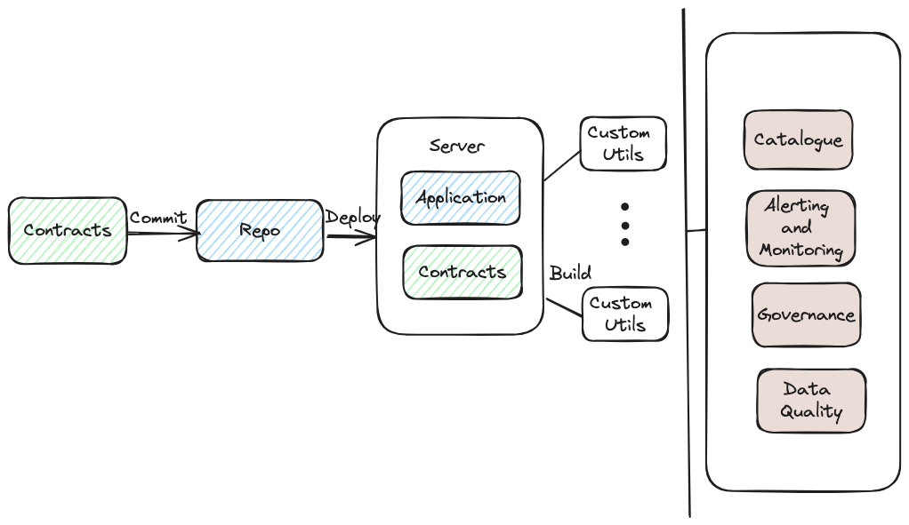
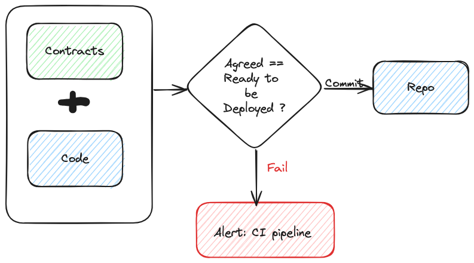

# Data Platform Contracts: YAML Templates for Streamlined Collaboration

## What are Contracts?

Contracts in the context of a data platform refer to agreements between producers and consumers of data or services. They adhere to pre-defined standards, ensuring consistency and reliability in providing and accessing services. While the term has gained popularity in Data Mesh, it has long been used in Object-Oriented Programming and system design, defining bounded contexts and integrating interfaces.

## Who Defines the Contract?

The contract is defined by the owners of the product, whether it's a data product or a data service. For instance, a team overseeing the data platform defines contracts adhered to by services like ETL and data pipelines on-boarded to the platform. Consumers of the data, on the other hand, define contracts with expectations regarding schema, data quality checks, delivery cadence, and SLAs.

## Why YAML and Not Bespoke Metadata?

As a data platform provider, numerous ETL applications may be on-boarded, each potentially having its own syntax for specifying metadata. However, it's not optimal for platform owners to extract metadata from each application. Keeping expectations minimal and confined to a pre-defined YAML template simplifies backend utilities. Additionally, managing and enhancing contracts in YAML is straightforward.

## Where to Store the Contracts?

Contracts can be deployed alongside applications and data pipelines in version-controlled repositories. Implementing checks within CI pipelines helps accept or reject commits and pull requests based on expected contracts during deployment.

For example, a new ETL pipeline will only be deployed to the data platform if the master branch has relevant contracts, providing pre-agreed information like the pipeline owner, accessed/modified tables, storage format (e.g., parquet/avro), cadence, and ACLs.

## Advantages

1. **Transparent Accountability:** Clearly defined contracts establish accountability for both producers and consumers.
   
2. **Enhanced Data Governance:** Well-defined information in contracts contributes to better data governance and management.

3. **Improved Monitoring and Cataloging:** Contracts facilitate better monitoring, data cataloging, and data lineage services.

4. **Circuit Breaker Checks:** Easily accessible and interpretable checks enable the implementation of effective circuit breakers for downstream users and consumers.

In adopting data contracts within a team or organization, these advantages contribute to a more streamlined and efficient data platform.
